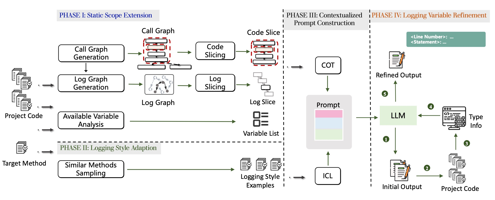

# SCLogger

This is the anonymous replication package for the FSE2024 submission "Go Static: Contextualized Logging Statement Generation". In this paper, we propose SCLogger, the first  logging statement generation approach powered by inter-method static contexts.

SCLogger consists of four phases: static scope extension, logging style adaption, contextulized prompt construction, logging variable refinement.

We will maintain this open source tool once the paper get accepted and continue improve the tool for further practical application.



## Repository Organization

## Datasets

Please download the processed datasets from [ProjectsSRC](https://drive.google.com/file/d/13f1qzi3Il5LHdeIiE7jw1cZTXo5PSwF_/view?usp=sharing), [ProcessedDatasets](https://drive.google.com/file/d/1sKaj_Bn1xYtACHQk2j7tIAQr5bGabBdw/view?usp=sharing) and then unzip these datasets into the directory of `./ProjectsSRC` and `./ProcessedDatasets`.

## Baselines

All baselines we used are reimplemented in the folder `./Baselines.`

## Static Analysis Part
We have packaged all the static analysis related Java code with all required dependencies into JARs for reproduction, you can refer these Jars in folder `./Build`.

### Code Slicing
Instruction for running the callgraph generators

```bash
java -jar javacg-0.1-SNAPSHOT-static.jar lib1.jar ... > cg.txt
```
```python
python generate_code_slice.py --cg cg.txt
 --src ./ProjectSrc/Project --method target_method_signature  --output output.txt
```


### Log Slicing

Instruction for pruning log-related call graphs

```bash
python generate_log_methods.py --cg cg.txt --output log_methods.csv --matcher 'log'
```

Instruction for getting log paths.

```bash
java -jar LogEPGen.jar -j input_jar.jar -l log_methods.txt -o log_file.json
```

Instruction for the generate and slice log graphs:

```bash
python generate_log_slice.py --call-graph-file cg.txt --log-file log_file.json --method target_method_signature --output-path ./prompts --hop 2
```


### Available Variable List


### Variable Refinement


## Prompt Generation
